# NextJS (React Framework) Todo App with Firebase Auth and Firestore

## Installation
```bash
npm i
```
## Running

For running locally, create a `.env.local` on the root with the following values

```
FIREBASE_API_KEY=<From your firebase config>
FIREBASE_AUTH_DOMAIN=<From your firebase config>
FIREBASE_PROJECT_ID=<From your firebase config>
FIREBASE_STORAGE_BUCKET=<From your firebase config>
FIREBASE_MESSAGING_SENDER_ID=<From your firebase config>
FIREBASE_APP_ID=<From your firebase config>
```

To get the values for your own firebase connection:

1. Go to [Firebase Console](https://console.firebase.google.com/u/0/).
2. Create a project
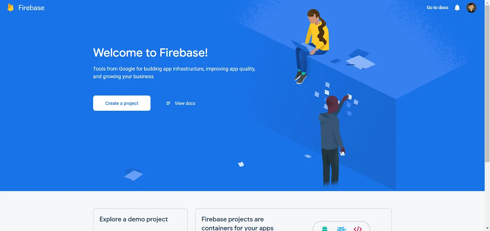
1. Add a web app to your project
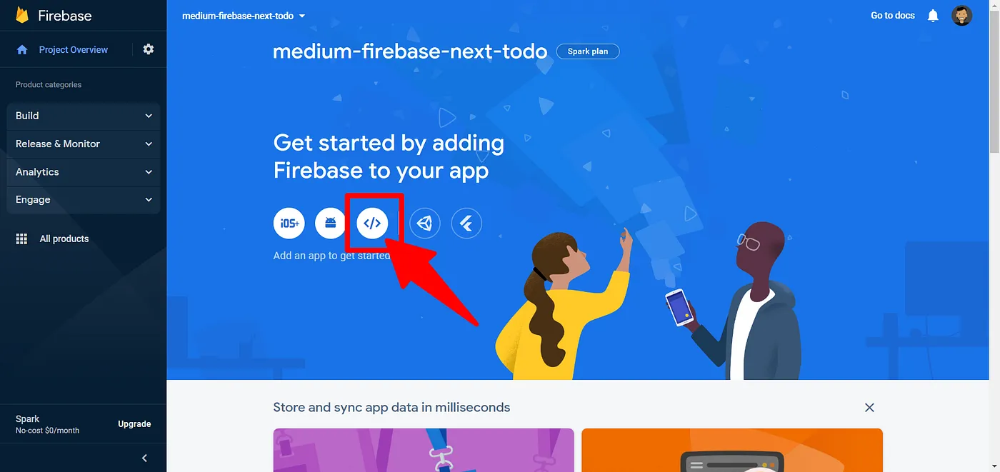
1. Register app
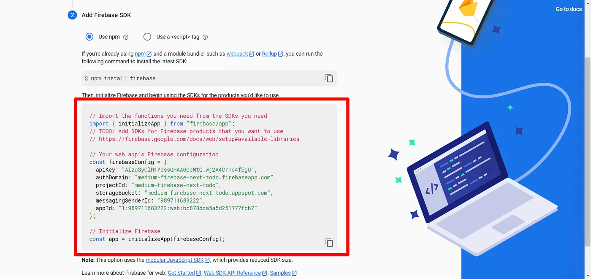

The values on red are the ones you need to put on your env file.

## Todo Demo

1. Dark/Light Mode (Not logged in)
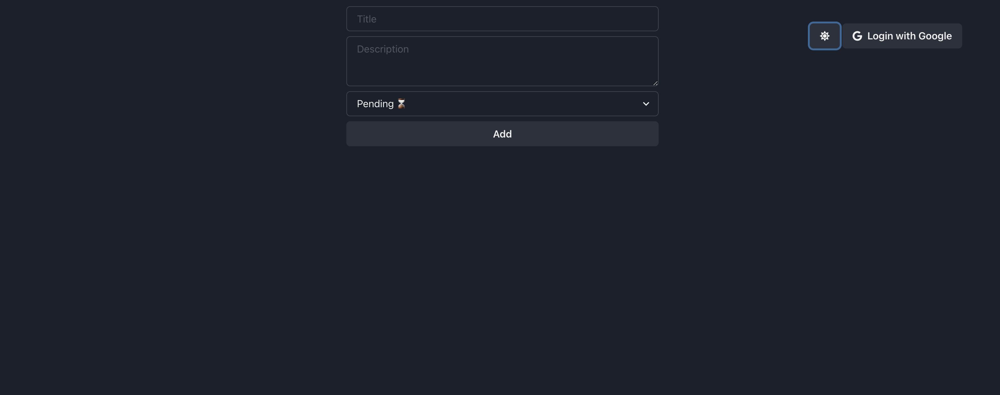

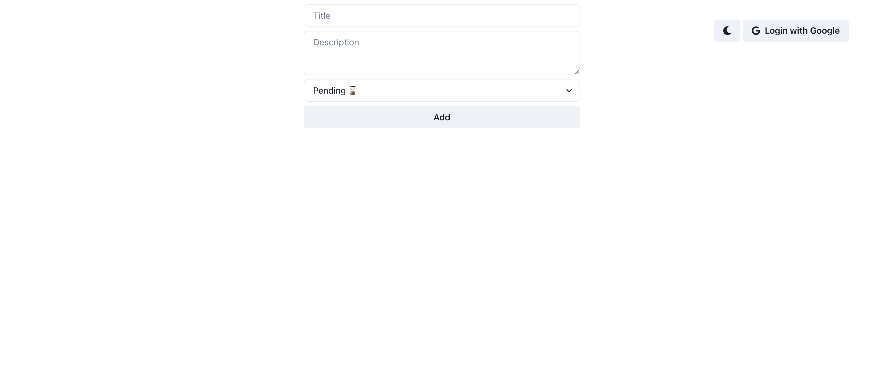
   
2. Login (only Google OAuth)
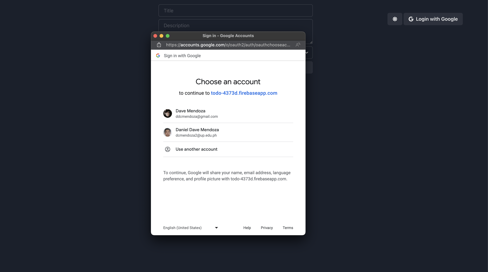
   
3. Home
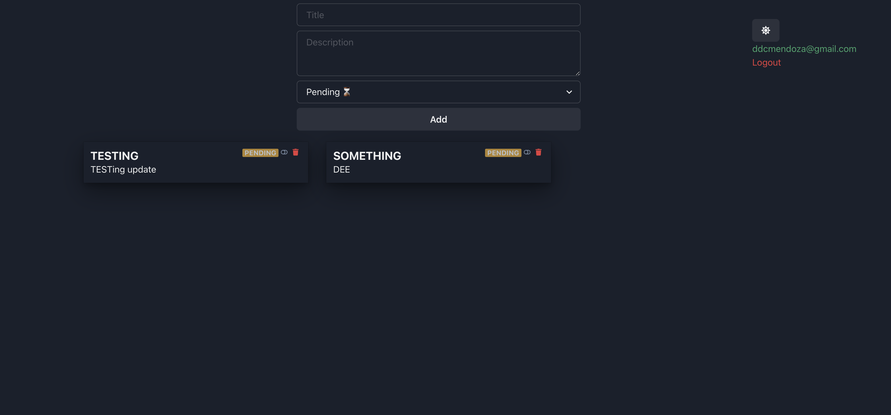
4. Creation
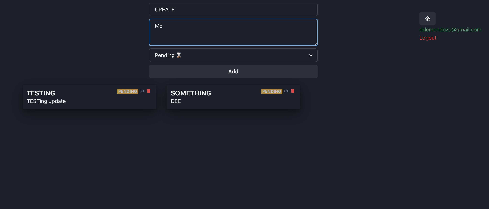
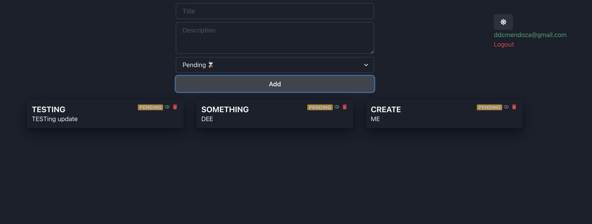
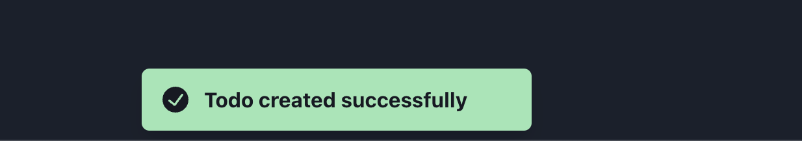
5. Deletion
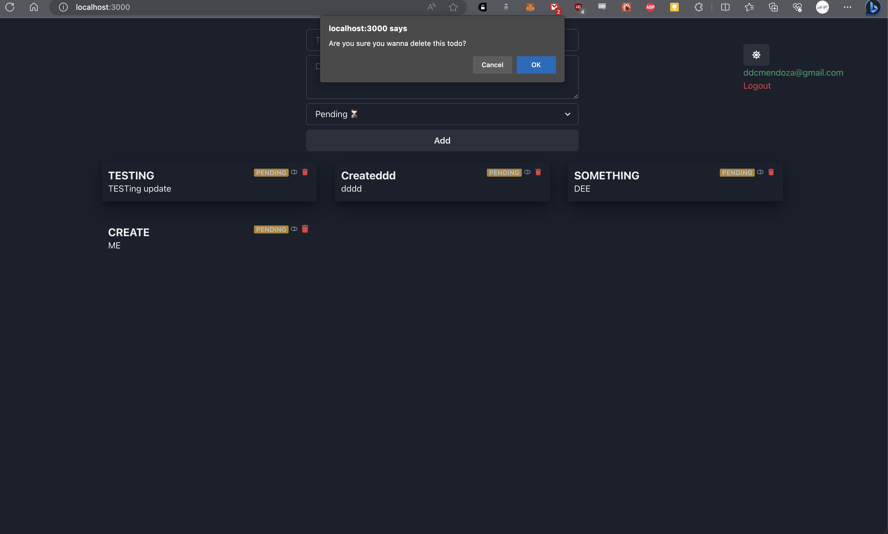
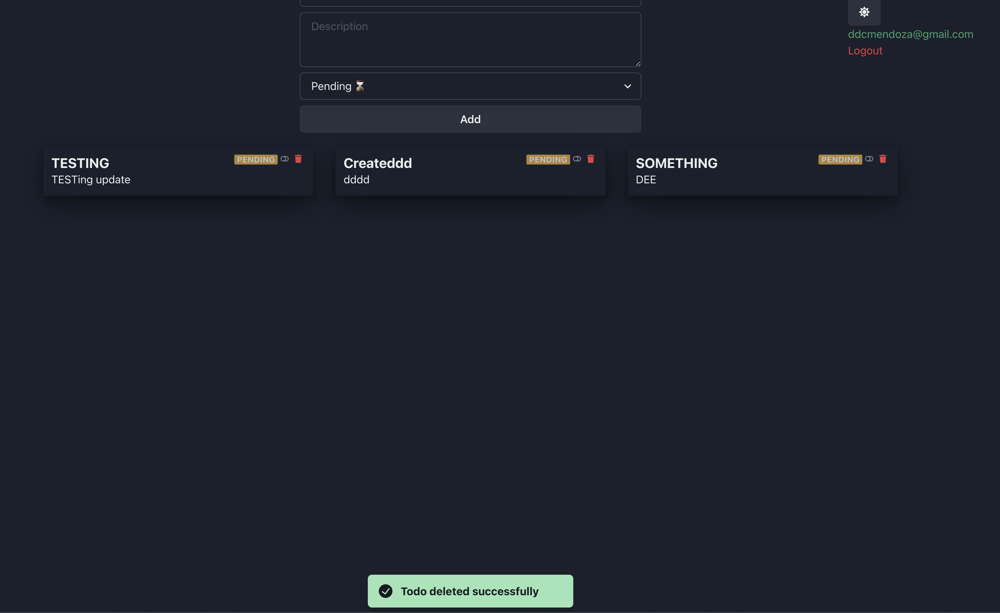
6. Update
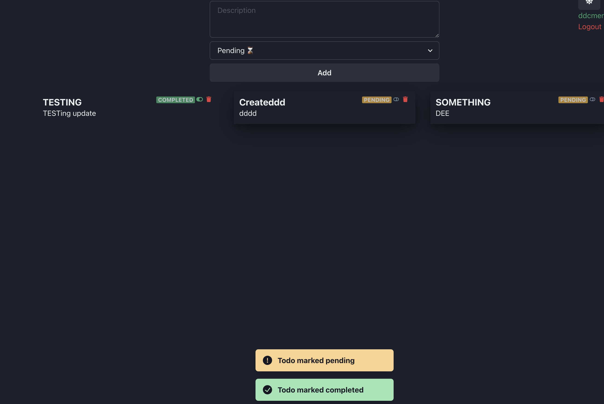
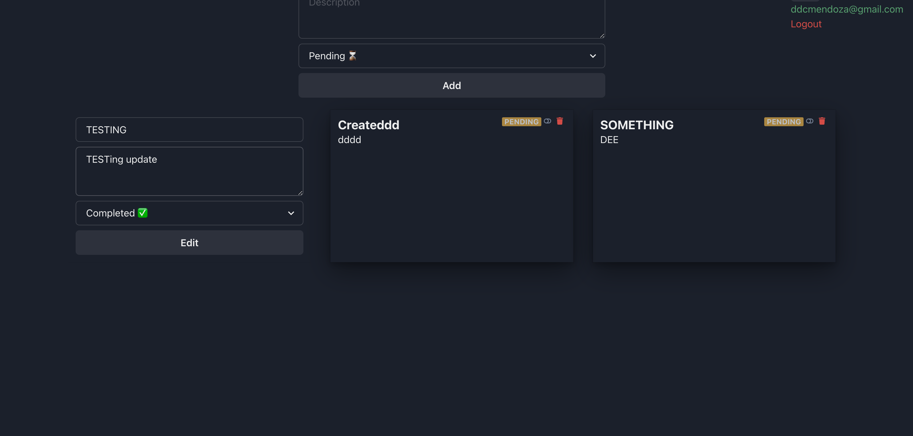
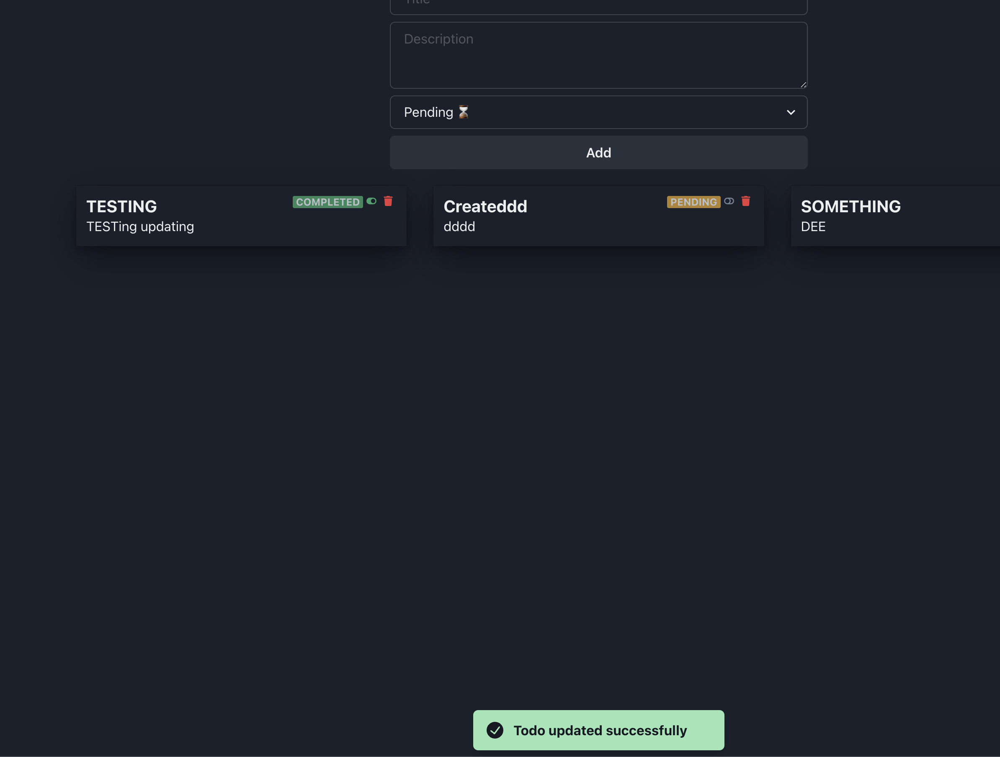